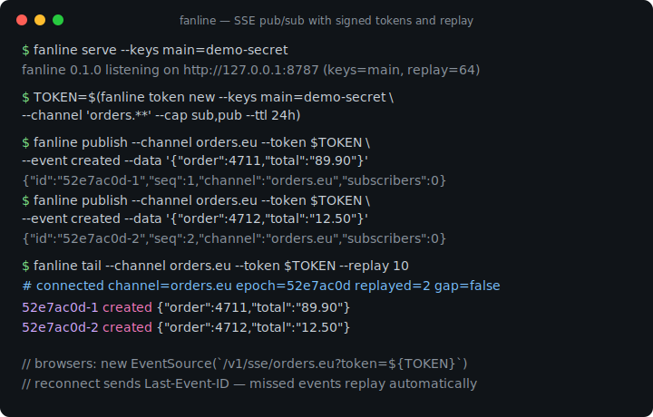
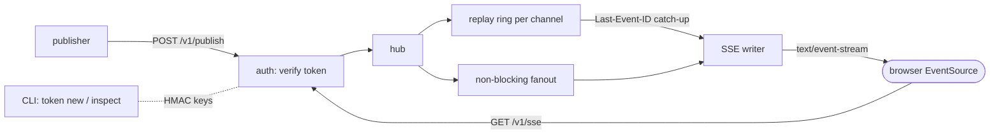

# fanline

[English](README.md) | [中文](README.zh.md) | [日本語](README.ja.md)

[](LICENSE) [](go.mod) [](CHANGELOG.md)  [](CONTRIBUTING.md)

**fanline：オープンソースでゼロ依存の SSE pub/sub ハブ —— 署名付きチャンネルトークン、再接続時の直近 N 件リプレイ、あらゆるプロキシを通過し、ブラウザ側にクライアントライブラリは一切不要。**



```bash
git clone https://github.com/JaydenCJ/fanline && cd fanline
go build -o fanline ./cmd/fanline    # single static binary, stdlib only
```

> プレリリース：v0.1.0 はまだパッケージレジストリに公開していません。上記の手順でソースからビルドしてください（Go ≥1.22 で可）。

## なぜ fanline？

ライブダッシュボード、通知フィード、進捗バーの大半に必要なのはただ一つ、サーバーから多数のブラウザへ小さなイベントを push することだけです。ところが定番の答えはどれも問題より重い。Pusher と Ably は接続数課金なので、人気が出たダッシュボードはそのまま請求書になる。セルフホストの受け皿だった soketi は停滞。WebSocket 層を自作すれば、クライアントライブラリ、upgrade に厳しいプロキシ、手書きの再接続ロジックが待っています。Server-Sent Events はトランスポートをとうに解決済みです —— 素の HTTP なのですべてのプロキシとロードバランサを通過し、ブラウザは `EventSource` で自動再接続、ライブラリ不要。SSE に足りないのはサーバー側だけ：チャンネル単位の認可、ファンアウト、そしてオフライン中に取りこぼした分のリプレイです。fanline がそのサーバーであり、依存ゼロの Go バイナリ 1 個に収まります。チャンネルは HMAC 署名のケイパビリティトークンで守られ（CLI でオフライン発行 —— subscribe、publish、その両方を `orders.**` のようなチャンネルパターンに限定）、各チャンネルはリプレイリングを保持するので、再接続したクライアントは標準の `Last-Event-ID` ヘッダーを送るだけで、逃したイベントを過不足なく受け取れます —— 履歴が破棄済みなら、正直な `gap` フラグが返ります。

| | fanline | Pusher / Ably | soketi | 自作 WebSocket |
|---|---|---|---|---|
| コストモデル | 自前マシン、定額 | 接続数 + メッセージ課金 | 自前マシン | 自前マシン + 開発工数 |
| クライアントライブラリ要否 | ❌ `EventSource` はブラウザ内蔵 | ✅ プラットフォーム毎に SDK | ✅ Pusher SDK | ✅ 自作 |
| 設定なしでプロキシ / LB を通過 | ✅ 素の HTTP | ✅（自社エッジ経由） | ⚠️ upgrade の通過設定が必要 | ⚠️ upgrade の通過設定が必要 |
| 再接続時に逃したイベントをリプレイ | ✅ `Last-Event-ID`、チャンネル毎リング | 一部、有償プラン | ❌ | ❌ 自分で実装 |
| チャンネル単位の署名ケイパビリティトークン | ✅ オフライン HMAC 発行 | ✅ | ✅ | ❌ 自分で実装 |
| 履歴喪失を推測でなく検知 | ✅ epoch + `gap` フラグ | ⚠️ | ❌ | ❌ |
| ランタイム依存 | 0（Go 標準ライブラリ） | 該当なし（SaaS） | Node + µWS ビルド | 場合による |

<sub>2026-07-12 時点で確認：fanline は Go 標準ライブラリのみを import。soketi の npm パッケージは 100+ の推移的依存を解決する。Pusher/Ably は同時接続数とメッセージ量で課金。fanline は意図的に単方向設計 —— クライアントから高頻度の上り送信が必要なら WebSocket を使ってください。</sub>

## 特徴

- **あえて SSE 専用** —— HTTP/1.1 上の素の `text/event-stream`：壊れる upgrade ハンドシェイクが存在せず、`X-Accel-Buffering: no` とコメント keepalive を標準装備。nginx、Caddy、社内ミドルボックスをそのまま通過します。
- **クライアントライブラリ不要** —— ブラウザは内蔵の `EventSource` を使うだけ。それ以外も行単位で読める HTTP クライアントがあれば十分。同梱の `fanline tail` CLI は運用者とスクリプト向けで、必須ではありません。
- **署名付きチャンネルトークン** —— CLI がオフラインで発行する `fl1.<claims>.<hmac>` ケイパビリティトークン：チャンネルパターン（`dash.tenant-4.*`、`orders.**`）、権限（`sub`、`pub`、`stats`）、有効期限、無停止ローテーション用の鍵 ID。`EventSource` はヘッダーを設定できないため URL セーフです。
- **嘘をつかないリプレイ** —— 各チャンネルは直近 N 件のリング（既定 64、TTL 任意）を保持。再接続は `Last-Event-ID` で再開し、要求した履歴が破棄済み、あるいはハブが再起動していた場合（epoch 変化）は、黙って取りこぼす代わりに `gap: true` を受け取ります。
- **遅い購読者がチャンネルを止めることはない** —— ファンアウトは非ブロッキング。読まなくなった購読者は切断され、自動再接続時のリプレイで追いつきます。
- **既定でオフラインかつ静か** —— `127.0.0.1` にバインドし、外向き接続ゼロ、テレメトリなし。`--dev`（認証オフ）はループバック以外へのバインドを拒否します。
- **依存ゼロ** —— Go 標準ライブラリのみ：ハブ、トークン発行、パブリッシャー、tail クライアントが静的バイナリ 1 個に収まります。

## クイックスタート

```bash
# 1. run a hub with one signing key
./fanline serve --keys main=demo-secret &

# 2. mint a token for the orders.* channel family
TOKEN=$(./fanline token new --keys main=demo-secret \
          --channel 'orders.**' --cap sub,pub --ttl 24h)

# 3. publish two events and tail them back (replay included)
./fanline publish --channel orders.eu --token $TOKEN \
          --event created --data '{"order":4711,"total":"89.90"}'
./fanline publish --channel orders.eu --token $TOKEN \
          --event created --data '{"order":4712,"total":"12.50"}'
./fanline tail --channel orders.eu --token $TOKEN --replay 10 --max 2
```

実際にキャプチャした出力：

```text
fanline 0.1.0 listening on http://127.0.0.1:8787 (keys=main, replay=64)
{"id":"52e7ac0d-1","seq":1,"channel":"orders.eu","subscribers":0}
{"id":"52e7ac0d-2","seq":2,"channel":"orders.eu","subscribers":0}
# connected channel=orders.eu epoch=52e7ac0d replayed=2 gap=false
52e7ac0d-1	created	{"order":4711,"total":"89.90"}
52e7ac0d-2	created	{"order":4712,"total":"12.50"}
```

ブラウザに SDK は不要 —— これがクライアントの全体です（動く版は [examples/dashboard.html](examples/dashboard.html)）：

```js
const es = new EventSource(`/v1/sse/orders.eu?replay=10&token=${TOKEN}`);
es.addEventListener("created", (e) => render(JSON.parse(e.data)));
// EventSource reconnects by itself and sends Last-Event-ID — replay is automatic.
```

## チャンネルトークン

トークンは `fl1.<base64url claims>.<base64url HMAC-SHA256>` 形式で、署名鍵を持つ誰もがオフラインで発行できます —— ハブとの往復は不要。完全なフォーマットは [docs/protocol.md](docs/protocol.md) を参照。

| クレーム | 例 | 意味 |
|---|---|---|
| `kid` | `main` | 署名鍵 ID。ローテーション中は複数の鍵を併用可能 |
| `ch` | `orders.**` | チャンネルパターン：`*` = 1 セグメント、末尾 `**` = 1 つ以上 |
| `cap` | `["sub","pub"]` | 権限：`sub` 購読、`pub` 発行、`stats` ハブ統計 |
| `iat` / `exp` | unix 秒 | 有効期間。`exp` 省略 = 無期限 |

`fanline token new --keys main=s3cret --channel 'dash.tenant-4.*' --cap sub --ttl 1h` がトークンを出力し、`fanline token inspect` がデコードと検証を行います。トークンは `Authorization: Bearer …`、`EventSource` の場合は `?token=…` で渡します。

## リプレイと再接続

各イベント ID は `<epoch>-<seq>`：チャンネル毎の連番に、チャンネル作成時に選ばれるランダムな epoch を組み合わせたものです。再接続時はクライアントの `Last-Event-ID` をリングと照合し、ストリームは `fanline.ready` フレーム —— `{"channel":…,"epoch":…,"replayed":N,"gap":false}` —— で始まり、逃したイベント、続いてライブイベントが流れます。要求した履歴が破棄済み（容量または TTL）か epoch が変わった（ハブ再起動）場合、`gap` は `true` になります：クライアントは連続性を仮定せず、状態を取り直すべきだと分かります。新規購読者は `?replay=N` でベストエフォートの履歴を要求することもできます。

## サーバーリファレンス

`fanline serve` のフラグ（環境変数：`FANLINE_ADDR`、`FANLINE_KEYS`）：

| フラグ | 既定値 | 効果 |
|---|---|---|
| `--addr` | `127.0.0.1:8787` | リッスンアドレス（`:0` で空きポートを選びログに出力） |
| `--keys` | — | `kid=secret[,kid2=secret2]`。`--dev` でない限り必須 |
| `--dev` | オフ | 認証を無効化。ループバック以外のアドレスは拒否 |
| `--replay` | `64` | リプレイ用にチャンネル毎に保持するイベント数 |
| `--replay-ttl` | `0` | リプレイ可能イベントの最大保持期間。`0` = 容量のみで破棄 |
| `--keepalive` | `25s` | SSE コメント keepalive の間隔（プロキシのアイドルタイムアウト対策） |
| `--retry-ms` | `3000` | クライアントへ送る再接続遅延のヒント |
| `--max-body` | `262144` | publish ボディのバイト上限 |
| `--max-channels` | `1024` | アクティブチャンネル上限（アイドルは掃除される） |
| `--sub-buffer` | `64` | 購読者毎のバッファ。超過した遅いクライアントは切断 |
| `--cors-origin` | — | `Access-Control-Allow-Origin` の値。空なら CORS 無効 |

エンドポイント：`GET /v1/sse/{channel}`（`sub` 必要）、`POST /v1/publish/{channel}`（`pub` 必要、イベント名は `X-Fanline-Event` か `?event=`）、`GET /v1/stats`（`stats` 必要）、`GET /v1/healthz`（認証なし）。エラーは JSON：`{"error":"…"}`。CLI 終了コード：0 成功、1 実行時エラー、2 使い方エラー。

## 検証

このリポジトリは CI を同梱しません。上記の主張はすべてローカル実行で検証されます：

```bash
go test ./...            # 91 deterministic tests, offline, < 5 s
bash scripts/smoke.sh    # end-to-end CLI check, prints SMOKE OK
```

## アーキテクチャ



## ロードマップ

- [x] v0.1.0 —— 署名付きチャンネルトークンを備えた SSE ハブ、epoch/gap セマンティクス付きのチャンネル毎リプレイリング、publish/tail/token CLI、91 テスト + smoke スクリプト
- [ ] `fanline stats` CLI サブコマンドと最小の HTML ステータスページ
- [ ] 再起動後も履歴が残るオプションのディスク上リプレイリング
- [ ] バッチ発行エンドポイント（`POST /v1/publish`、NDJSON ボディ）
- [ ] ワイルドカード購読（`/v1/sse/orders.**`）とチャンネル修飾イベント ID
- [ ] `stats` 権限で保護された Prometheus 形式メトリクス

完全なリストは [open issues](https://github.com/JaydenCJ/fanline/issues) を参照。

## コントリビュート

Issue、ディスカッション、PR を歓迎します —— ローカルワークフロー（フォーマット、vet、テスト、`SMOKE OK`）は [CONTRIBUTING.md](CONTRIBUTING.md) を参照。入門タスクには [good first issue](https://github.com/JaydenCJ/fanline/issues?q=is%3Aissue+is%3Aopen+label%3A%22good+first+issue%22) ラベルが付いており、設計の議論は [Discussions](https://github.com/JaydenCJ/fanline/discussions) で行っています。

## ライセンス

[MIT](LICENSE)
