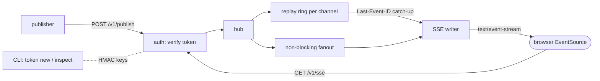

# fanline

[English](README.md) | [中文](README.zh.md) | [日本語](README.ja.md)

[](LICENSE) [](go.mod) [](CHANGELOG.md)  [](CONTRIBUTING.md)

**fanline：an open-source, zero-dependency SSE pub/sub hub — signed channel tokens, last-N replay on reconnect, works through any proxy, and browsers need no client library at all.**


```bash
git clone https://github.com/JaydenCJ/fanline && cd fanline
go build -o fanline ./cmd/fanline    # single static binary, stdlib only
```

> Pre-release: v0.1.0 is not tagged on a package registry yet; build from source as above (any Go ≥1.22).

## Why fanline?

Most live dashboards, notification feeds, and progress bars need exactly one thing: the server pushing small events to many browsers. The default answers are all heavier than the problem. Pusher and Ably meter every connection, so a popular dashboard turns into a bill; soketi, the self-hosted escape hatch, has stalled; and rolling your own WebSocket layer means a client library, upgrade-hostile proxies, and hand-written reconnect logic. Server-Sent Events already solve the transport — it is plain HTTP, passes through every proxy and load balancer, and browsers reconnect automatically with `EventSource`, no library needed. What SSE lacks out of the box is a server: per-channel auth, fanout, and replay of what a client missed while offline. fanline is that server, in one Go binary with zero dependencies. Channels are guarded by HMAC-signed capability tokens (mint them offline with the CLI — subscribe, publish, or both, scoped to a channel pattern like `orders.**`), and every channel keeps a replay ring, so a reconnecting client sends the standard `Last-Event-ID` header and receives exactly the events it missed — or an honest `gap` flag when history has been evicted.

| | fanline | Pusher / Ably | soketi | hand-rolled WebSocket |
|---|---|---|---|---|
| Cost model | your box, flat | per connection + message | your box | your box + dev time |
| Client library required | ❌ `EventSource` is built in | ✅ SDK per platform | ✅ Pusher SDK | ✅ your own |
| Survives proxies / LB without config | ✅ plain HTTP | ✅ (their edge) | ⚠️ needs upgrade passthrough | ⚠️ needs upgrade passthrough |
| Replay of missed events on reconnect | ✅ `Last-Event-ID`, per-channel ring | partial, paid tiers | ❌ | ❌ build it yourself |
| Signed per-channel capability tokens | ✅ offline HMAC mint | ✅ | ✅ | ❌ build it yourself |
| Detects lost history instead of guessing | ✅ epoch + `gap` flag | ⚠️ | ❌ | ❌ |
| Runtime dependencies | 0 (Go stdlib) | n/a (SaaS) | Node + µWS build | varies |

<sub>Checked 2026-07-12: fanline imports the Go standard library only; soketi's npm package resolves 100+ transitive dependencies; Pusher/Ably price by concurrent connections and messages. fanline is one-directional by design — if clients must send high-frequency data upstream, use WebSockets.</sub>

## Features

- **SSE-only, on purpose** — plain `text/event-stream` over HTTP/1.1: no upgrade handshake to break, `X-Accel-Buffering: no` and comment keepalives baked in, so nginx, Caddy, and corporate middleboxes just pass it through.
- **No client library** — browsers use the built-in `EventSource`; anything else needs only an HTTP client that can read lines. The bundled `fanline tail` CLI is for operators and scripts, not a requirement.
- **Signed channel tokens** — `fl1.<claims>.<hmac>` capability tokens minted offline by the CLI: channel pattern (`dash.tenant-4.*`, `orders.**`), capabilities (`sub`, `pub`, `stats`), expiry, and key ID for zero-downtime rotation. URL-safe, because `EventSource` cannot set headers.
- **Replay that tells the truth** — every channel keeps a last-N ring (default 64, TTL optional). Reconnects resume via `Last-Event-ID`; if the requested history was evicted or the hub restarted (epoch change), the client gets `gap: true` instead of silent loss.
- **Slow consumers never stall a channel** — fanout is non-blocking; a subscriber that stops reading is disconnected and recovers through replay on its automatic reconnect.
- **Offline and quiet by default** — binds `127.0.0.1`, makes zero outbound connections, no telemetry; `--dev` (auth off) refuses to bind anything but loopback.
- **Zero dependencies** — Go standard library only: one static binary for the hub, the token mint, the publisher, and the tail client.

## Quickstart

```bash
# 1. run a hub with one signing key
./fanline serve --keys main=demo-secret &

# 2. mint a token for the orders.* channel family
TOKEN=$(./fanline token new --keys main=demo-secret \
          --channel 'orders.**' --cap sub,pub --ttl 24h)

# 3. publish two events and tail them back (replay included)
./fanline publish --channel orders.eu --token $TOKEN \
          --event created --data '{"order":4711,"total":"89.90"}'
./fanline publish --channel orders.eu --token $TOKEN \
          --event created --data '{"order":4712,"total":"12.50"}'
./fanline tail --channel orders.eu --token $TOKEN --replay 10 --max 2
```

Real captured output:

```text
fanline 0.1.0 listening on http://127.0.0.1:8787 (keys=main, replay=64)
{"id":"52e7ac0d-1","seq":1,"channel":"orders.eu","subscribers":0}
{"id":"52e7ac0d-2","seq":2,"channel":"orders.eu","subscribers":0}
# connected channel=orders.eu epoch=52e7ac0d replayed=2 gap=false
52e7ac0d-1	created	{"order":4711,"total":"89.90"}
52e7ac0d-2	created	{"order":4712,"total":"12.50"}
```

A browser needs no SDK — this is the whole client (see [examples/dashboard.html](examples/dashboard.html) for a live version):

```js
const es = new EventSource(`/v1/sse/orders.eu?replay=10&token=${TOKEN}`);
es.addEventListener("created", (e) => render(JSON.parse(e.data)));
// EventSource reconnects by itself and sends Last-Event-ID — replay is automatic.
```

## Channel tokens

Tokens are `fl1.<base64url claims>.<base64url HMAC-SHA256>`, minted offline by anyone holding a signing key — no round trip to the hub. Full format in [docs/protocol.md](docs/protocol.md).

| Claim | Example | Meaning |
|---|---|---|
| `kid` | `main` | signing key ID; several keys may be live during rotation |
| `ch` | `orders.**` | channel pattern: `*` = one segment, trailing `**` = one or more |
| `cap` | `["sub","pub"]` | grants: `sub` subscribe, `pub` publish, `stats` hub stats |
| `iat` / `exp` | unix seconds | validity window; `exp` omitted = never expires |

`fanline token new --keys main=s3cret --channel 'dash.tenant-4.*' --cap sub --ttl 1h` prints the token; `fanline token inspect` decodes and verifies it. Tokens travel as `Authorization: Bearer …` or, for `EventSource`, as `?token=…`.

## Replay & reconnect

Every event ID is `<epoch>-<seq>`: a per-channel counter plus a random epoch chosen when the channel is created. On reconnect the client's `Last-Event-ID` is matched against the ring and the stream opens with a `fanline.ready` frame — `{"channel":…,"epoch":…,"replayed":N,"gap":false}` — followed by the missed events, then live ones. `gap` turns `true` when the requested history was already evicted (capacity or TTL) or the epoch changed (hub restart): the client knows it must refetch state instead of assuming continuity. New subscribers can also ask for best-effort history with `?replay=N`.

## Server reference

`fanline serve` flags (env: `FANLINE_ADDR`, `FANLINE_KEYS`):

| Flag | Default | Effect |
|---|---|---|
| `--addr` | `127.0.0.1:8787` | listen address (`:0` picks a free port and logs it) |
| `--keys` | — | `kid=secret[,kid2=secret2]`; required unless `--dev` |
| `--dev` | off | disable auth; refuses non-loopback addresses |
| `--replay` | `64` | events retained per channel for replay |
| `--replay-ttl` | `0` | max age of replayable events; `0` = capacity-only |
| `--keepalive` | `25s` | SSE comment keepalive interval (proxy idle-timeout safety) |
| `--retry-ms` | `3000` | reconnect delay hint sent to clients |
| `--max-body` | `262144` | publish body limit in bytes |
| `--max-channels` | `1024` | live channel limit (idle channels are swept) |
| `--sub-buffer` | `64` | per-subscriber buffer before a slow client is dropped |
| `--cors-origin` | — | `Access-Control-Allow-Origin` value; empty disables CORS |

Endpoints: `GET /v1/sse/{channel}` (cap `sub`), `POST /v1/publish/{channel}` (cap `pub`, event name via `X-Fanline-Event` or `?event=`), `GET /v1/stats` (cap `stats`), `GET /v1/healthz` (open). Errors are JSON: `{"error":"…"}`. CLI exit codes: 0 ok, 1 runtime failure, 2 usage.

## Verification

This repository ships no CI; every claim above is verified by local runs:

```bash
go test ./...            # 91 deterministic tests, offline, < 5 s
bash scripts/smoke.sh    # end-to-end CLI check, prints SMOKE OK
```

## Architecture



## Roadmap

- [x] v0.1.0 — SSE hub with signed channel tokens, per-channel replay ring with epoch/gap semantics, publish/tail/token CLI, 91 tests + smoke script
- [ ] `fanline stats` CLI subcommand and a minimal HTML status page
- [ ] Optional on-disk replay ring so history survives restarts
- [ ] Batch publish endpoint (`POST /v1/publish` with NDJSON body)
- [ ] Wildcard subscribe (`/v1/sse/orders.**`) with channel-qualified event IDs
- [ ] Prometheus-format metrics behind the `stats` capability

See the [open issues](https://github.com/JaydenCJ/fanline/issues) for the full list.

## Contributing

Issues, discussions and pull requests are welcome — see [CONTRIBUTING.md](CONTRIBUTING.md) for the local workflow (format, vet, tests, `SMOKE OK`). Good entry points are labelled [good first issue](https://github.com/JaydenCJ/fanline/issues?q=is%3Aissue+is%3Aopen+label%3A%22good+first+issue%22), and design questions live in [Discussions](https://github.com/JaydenCJ/fanline/discussions).

## License

[MIT](LICENSE)
