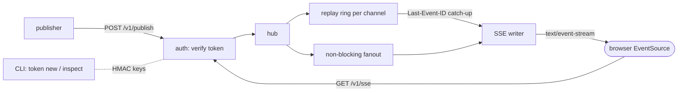

# fanline

[English](README.md) | [中文](README.zh.md) | [日本語](README.ja.md)

[](LICENSE) [](go.mod) [](CHANGELOG.md)  [](CONTRIBUTING.md)

**fanline：开源、零依赖的 SSE 发布/订阅中枢 —— 签名频道令牌、重连时回放最近 N 条、穿透任意代理，浏览器端完全不需要客户端库。**


```bash
git clone https://github.com/JaydenCJ/fanline && cd fanline
go build -o fanline ./cmd/fanline    # single static binary, stdlib only
```

> 预发布说明：v0.1.0 尚未发布到任何包仓库；请按上述方式从源码构建（Go ≥1.22 即可）。

## 为什么选 fanline？

绝大多数实时仪表盘、通知流和进度条要的其实只有一件事：服务端把小事件推给一群浏览器。而默认答案全都比问题本身更重。Pusher 和 Ably 按连接数计费，仪表盘一旦受欢迎就变成账单；自托管的替身 soketi 已经停滞；自己搭 WebSocket 层则意味着客户端库、对 upgrade 不友好的代理，以及手写的重连逻辑。Server-Sent Events 早已解决了传输层 —— 它是纯 HTTP，能穿过所有代理和负载均衡器，浏览器用 `EventSource` 自动重连，无需任何库。SSE 缺的只是一个服务端：按频道鉴权、扇出，以及回放客户端离线期间错过的内容。fanline 就是这个服务端，一个零依赖的 Go 二进制。频道由 HMAC 签名的能力令牌守护（用 CLI 离线铸造 —— 订阅、发布或二者兼有，作用域限定为 `orders.**` 这样的频道模式），每个频道都维护一个回放环，重连的客户端发送标准的 `Last-Event-ID` 头，就能收到恰好错过的那些事件 —— 若历史已被淘汰，则得到一个诚实的 `gap` 标记。

| | fanline | Pusher / Ably | soketi | 手搓 WebSocket |
|---|---|---|---|---|
| 成本模型 | 自己的机器，固定 | 按连接 + 消息计费 | 自己的机器 | 自己的机器 + 开发时间 |
| 是否需要客户端库 | ❌ `EventSource` 浏览器内置 | ✅ 每平台一个 SDK | ✅ Pusher SDK | ✅ 自己写 |
| 免配置穿透代理 / 负载均衡 | ✅ 纯 HTTP | ✅（走它们的边缘） | ⚠️ 需放行 upgrade | ⚠️ 需放行 upgrade |
| 重连时回放错过的事件 | ✅ `Last-Event-ID`，按频道回放环 | 部分支持，付费档 | ❌ | ❌ 自己实现 |
| 按频道签名能力令牌 | ✅ 离线 HMAC 铸造 | ✅ | ✅ | ❌ 自己实现 |
| 检测历史丢失而非瞎猜 | ✅ epoch + `gap` 标记 | ⚠️ | ❌ | ❌ |
| 运行时依赖 | 0（Go 标准库） | 不适用（SaaS） | Node + µWS 构建 | 视情况 |

<sub>核对于 2026-07-12：fanline 只导入 Go 标准库；soketi 的 npm 包解析出 100+ 传递依赖；Pusher/Ably 按并发连接与消息量定价。fanline 有意只做单向推送 —— 若客户端需要高频上行数据，请用 WebSocket。</sub>

## 特性

- **有意只做 SSE** —— HTTP/1.1 上的纯 `text/event-stream`：没有会被掐断的 upgrade 握手，内置 `X-Accel-Buffering: no` 与注释保活，nginx、Caddy 和企业中间盒直接放行。
- **无客户端库** —— 浏览器用内置的 `EventSource`；其余场景只需一个能按行读取的 HTTP 客户端。自带的 `fanline tail` CLI 是给运维和脚本用的，并非必需。
- **签名频道令牌** —— CLI 离线铸造的 `fl1.<claims>.<hmac>` 能力令牌：频道模式（`dash.tenant-4.*`、`orders.**`）、能力（`sub`、`pub`、`stats`）、过期时间，以及支持零停机轮换的密钥 ID。URL 安全编码，因为 `EventSource` 无法设置请求头。
- **说真话的回放** —— 每个频道保留最近 N 条（默认 64，可选 TTL）。重连经 `Last-Event-ID` 续传；若所需历史已被淘汰或中枢重启过（epoch 变化），客户端会收到 `gap: true`，而不是被静默丢消息。
- **慢消费者永远拖不垮频道** —— 扇出不阻塞；停止读取的订阅者会被断开，并在自动重连时通过回放补齐。
- **默认离线且安静** —— 绑定 `127.0.0.1`，零出站连接，无遥测；`--dev`（关闭鉴权）拒绝绑定任何非环回地址。
- **零依赖** —— 只用 Go 标准库：中枢、令牌铸造、发布器和 tail 客户端全在一个静态二进制里。

## 快速上手

```bash
# 1. run a hub with one signing key
./fanline serve --keys main=demo-secret &

# 2. mint a token for the orders.* channel family
TOKEN=$(./fanline token new --keys main=demo-secret \
          --channel 'orders.**' --cap sub,pub --ttl 24h)

# 3. publish two events and tail them back (replay included)
./fanline publish --channel orders.eu --token $TOKEN \
          --event created --data '{"order":4711,"total":"89.90"}'
./fanline publish --channel orders.eu --token $TOKEN \
          --event created --data '{"order":4712,"total":"12.50"}'
./fanline tail --channel orders.eu --token $TOKEN --replay 10 --max 2
```

真实捕获的输出：

```text
fanline 0.1.0 listening on http://127.0.0.1:8787 (keys=main, replay=64)
{"id":"52e7ac0d-1","seq":1,"channel":"orders.eu","subscribers":0}
{"id":"52e7ac0d-2","seq":2,"channel":"orders.eu","subscribers":0}
# connected channel=orders.eu epoch=52e7ac0d replayed=2 gap=false
52e7ac0d-1	created	{"order":4711,"total":"89.90"}
52e7ac0d-2	created	{"order":4712,"total":"12.50"}
```

浏览器不需要任何 SDK —— 下面就是完整客户端（可运行版本见 [examples/dashboard.html](examples/dashboard.html)）：

```js
const es = new EventSource(`/v1/sse/orders.eu?replay=10&token=${TOKEN}`);
es.addEventListener("created", (e) => render(JSON.parse(e.data)));
// EventSource reconnects by itself and sends Last-Event-ID — replay is automatic.
```

## 频道令牌

令牌形如 `fl1.<base64url claims>.<base64url HMAC-SHA256>`，任何持有签名密钥的人都可离线铸造 —— 无需与中枢往返。完整格式见 [docs/protocol.md](docs/protocol.md)。

| 声明 | 示例 | 含义 |
|---|---|---|
| `kid` | `main` | 签名密钥 ID；轮换期间可同时启用多把密钥 |
| `ch` | `orders.**` | 频道模式：`*` = 一段，结尾 `**` = 一段或多段 |
| `cap` | `["sub","pub"]` | 授权：`sub` 订阅、`pub` 发布、`stats` 中枢统计 |
| `iat` / `exp` | unix 秒 | 有效期窗口；省略 `exp` = 永不过期 |

`fanline token new --keys main=s3cret --channel 'dash.tenant-4.*' --cap sub --ttl 1h` 输出令牌；`fanline token inspect` 解码并校验。令牌可放在 `Authorization: Bearer …`，或为 `EventSource` 放在 `?token=…`。

## 回放与重连

每个事件 ID 形如 `<epoch>-<seq>`：按频道递增的计数器，加上频道创建时随机生成的 epoch。重连时，客户端的 `Last-Event-ID` 与回放环比对，流以一个 `fanline.ready` 帧开场 —— `{"channel":…,"epoch":…,"replayed":N,"gap":false}` —— 随后是错过的事件，再接实时事件。当所需历史已被淘汰（容量或 TTL）或 epoch 变化（中枢重启）时，`gap` 变为 `true`：客户端知道该重新拉取状态，而不是假装连续。新订阅者也可以用 `?replay=N` 索取尽力而为的历史。

## 服务端参考

`fanline serve` 参数（环境变量：`FANLINE_ADDR`、`FANLINE_KEYS`）：

| 参数 | 默认值 | 作用 |
|---|---|---|
| `--addr` | `127.0.0.1:8787` | 监听地址（`:0` 自动选空闲端口并写入日志） |
| `--keys` | — | `kid=secret[,kid2=secret2]`；除非 `--dev`，否则必填 |
| `--dev` | 关 | 关闭鉴权；拒绝非环回地址 |
| `--replay` | `64` | 每频道为回放保留的事件数 |
| `--replay-ttl` | `0` | 可回放事件的最大年龄；`0` = 仅按容量淘汰 |
| `--keepalive` | `25s` | SSE 注释保活间隔（防代理空闲超时） |
| `--retry-ms` | `3000` | 发给客户端的重连延迟提示 |
| `--max-body` | `262144` | 发布请求体字节上限 |
| `--max-channels` | `1024` | 活跃频道上限（空闲频道会被清扫） |
| `--sub-buffer` | `64` | 每订阅者缓冲区大小，超出即断开慢客户端 |
| `--cors-origin` | — | `Access-Control-Allow-Origin` 的值；留空则关闭 CORS |

端点：`GET /v1/sse/{channel}`（需 `sub`）、`POST /v1/publish/{channel}`（需 `pub`，事件名经 `X-Fanline-Event` 或 `?event=`）、`GET /v1/stats`（需 `stats`）、`GET /v1/healthz`（开放）。错误为 JSON：`{"error":"…"}`。CLI 退出码：0 成功，1 运行时失败，2 用法错误。

## 验证

本仓库不附带 CI；上述每一条声明都由本地运行验证：

```bash
go test ./...            # 91 deterministic tests, offline, < 5 s
bash scripts/smoke.sh    # end-to-end CLI check, prints SMOKE OK
```

## 架构



## 路线图

- [x] v0.1.0 —— 带签名频道令牌的 SSE 中枢、含 epoch/gap 语义的每频道回放环、publish/tail/token CLI、91 个测试 + smoke 脚本
- [ ] `fanline stats` CLI 子命令与极简 HTML 状态页
- [ ] 可选的磁盘回放环，让历史在重启后存活
- [ ] 批量发布端点（`POST /v1/publish`，NDJSON 请求体）
- [ ] 通配订阅（`/v1/sse/orders.**`）与频道限定的事件 ID
- [ ] `stats` 能力保护下的 Prometheus 格式指标

完整列表见 [open issues](https://github.com/JaydenCJ/fanline/issues)。

## 参与贡献

欢迎 issue、讨论和 PR —— 本地工作流（格式化、vet、测试、`SMOKE OK`）见 [CONTRIBUTING.md](CONTRIBUTING.md)。入门任务标记为 [good first issue](https://github.com/JaydenCJ/fanline/issues?q=is%3Aissue+is%3Aopen+label%3A%22good+first+issue%22)，设计讨论在 [Discussions](https://github.com/JaydenCJ/fanline/discussions)。

## 许可证

[MIT](LICENSE)
